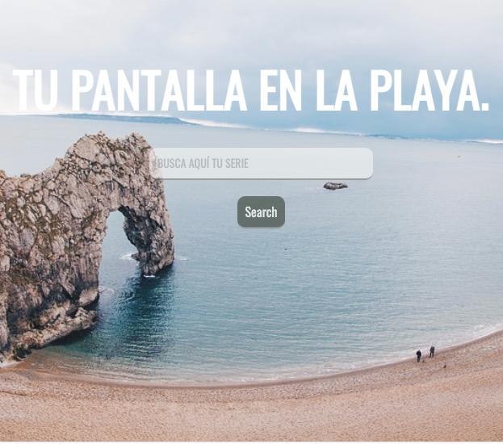

#README

# Tu pantalla en la playa

Statement:

The exercise consists of developing a web application to search for TV series that allows us to
mark and unmark the series as favorites and save them in local storage.
The exercise also has a layout part with HTML and Sass.
Let's define the different milestones that the exercise has consisted of:

1. Basic structure

   First, make a basic structure on this model.

   The series search application should consist of two parts:

   1. A text field and a button to search for series by title.
   2. A list of search results where the poster of the series and the title appear.

2. Search

   When clicking on the Search button, the application must connect to the open TVMaze API to
   series search. To build the search URL, you must collect the text that the user has entered in the field
   search.

   For each show contained in the search result you have to paint a card where we show
   an image of the series and the title, it is the list of favorite series.
   Some of the strings returned by the API have no image. In that case you have to show an image
   filler.

   To paint the information on the page you can choose between doing it in a basic way with innerHTML or
   advanced manipulation of the DOM.

3. Favorites

   - Once the search results appear, the user can indicate which are our favorite series.

   To do this, when clicking on a series the following must happen:

   - The background color and the font color are interchanged, indicating that it is a favorite series.
   - You have to show a list on the left side of the screen, below the search form, with
     favorite series.
   - Favorite series should continue to appear on the left even if the user performs another search.

4. Local storage.

   Store the list of favorites in the localStorage. In this way, when reloading the page the list of
   favorites should be displayed.

5. BONUS: Delete favorites

   As a bonus, we offer you the option to delete favorites. By clicking on the 'x' icon next to
   each favorite, you have to delete the clicked favorite from the list and from the localStorage.
   To finish finishing our series app, we would like to be able to add / remove as a favorite by clicking
   over a series on the right hand side. And what, if we do a new search and a series comes up that is already
   favorite, is already highlighted in the search results (with swapped background and text colors).
   And it would be great if at the end of the list of favorites there is a button to delete all the favorites at once.

6. BONUS: Fine-tune the layout

   Once the interaction part is finished, we can focus on the layout part where we can decide the styles.

7. Technologies applied in this exercise:

- General:
  Use an adequate structure of files and folders for a web project, and link the different ones well
  files _.
  Have the code perfectly indented _.
  Using version control with branches to manage a code project.

- JavaScript:
  Create JavaScript code with correct and well-structured syntax _.
  Use constants / variables to store information and reassign _ values.
  Use conditionals to execute different actions based on a _ condition.
  Know how to work with data lists (arrays).
  Use functions to structure your code.
  Know how to modify the DOM information to add dynamic content _.
  Know how to listen to DOM events and act accordingly.

-AJAX requests and APIs
Create requests with fetch and promises.
Know how to work correctly with the server's response \*.
Manage information in JSON format.
Use the localStorage to save information in the browser.
